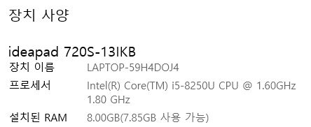

# Cordova 포트폴리오 앱    

### [Template출처](https://html5up.net/)    

---    

### 하드웨어 및 소프트웨어    

윈도우 10    

---    

Cordova를 이용해 만든 Hybrid 포트폴리오 앱 입니다.    

* 앱 동작 스크린샷    

---    

### 추가하고 싶은 사항

Firebase 의 google-services.json 및 build.gradle 수정을 통해 Firebase 프로젝트 연동은 성공했지만 Database 연결은 시간이 부족해 시도해보지 못했습니다.    

* Firebase 프로젝트 스크린샷    

